# 🏠 Neighborhood Intelligence Agent

A sophisticated **Multi-Agent System** that simulates "living" in any US neighborhood before you move there. It uses a team of specialist AI agents to analyze a location from multiple angles—commute, safety, schools, lifestyle, and future development—customized to your personal life situation.

## 🧠 Architecture: Multi-Agent Orchestrator

This project is a **Multi-Agent System** (not a basic agent). It follows the **Orchestrator-Workers pattern**:

```mermaid
graph TD
    User[User Profile] --> Orchestrator
    Orchestrator[🤖 Orchestrator Agent]
    
    Orchestrator --> Commute[🚗 Commute Agent]
    Orchestrator --> Lifestyle[🏃 Lifestyle Agent]
    Orchestrator --> News[📰 City Planner Agent]
    Orchestrator --> Schools[🏫 School Agent]
    Orchestrator --> Safety[🛡️ Safety Agent]
    
    Commute --> MapsAPI[Google Maps API]
    Lifestyle --> PlacesAPI[Google Places API]
    News --> Search[DuckDuckGo Search]
    Schools --> Search
    Safety --> Search
    
    Commute --> Synthesis
    Lifestyle --> Synthesis
    News --> Synthesis
    Schools --> Synthesis
    Safety --> Synthesis
    
    Synthesis[📋 Collaborative Synthesis] --> Report["Final Day in the Life Report"]
```



### The Agent Team
1.  **🤖 Orchestrator**: The "Team Lead". Receives user requirements, delegates tasks to specialists, handles API rate limits (with exponential backoff), and synthesizes all reports into a cohesive narrative.
2.  **🚗 Commute Agent**: Uses **Google Maps API** (Directions & Distance Matrix) to calculate *real* rush-hour vs. off-peak driving times and transit options.
3.  **🏃 Lifestyle Agent**: Uses **Google Places API** to find amenities that match your specific habits (e.g., "gyms open late", "organic grocery", "temples"). 
4.  **📰 City Planner Agent**: Uses **DuckDuckGo Search** to scrape news and city council minutes for upcoming construction projects, zoning changes, or gentrification trends.
5.  **🏫 School Agent**: Research local school ratings, parent reviews, and recent controversy/accolades using web searches.
6.  **🛡️ Safety Agent**: Analyzes crime trends, safety maps, and police reports for specific street-level insights.

## 🛠️ Technology Stack
-   **Core Brain**: Google Gemini 2.0 Flash (fast, reasoning-capable)
-   **Framework**: Python + Streamlit (Frontend)
-   **Tools/APIs**:
    -   `Google Maps Platform` (Geocoding, Routes)
    -   `Google Places` (Nearby Search)
    -   `DuckDuckGo` (Web Search)
    -   `Firecrawl` (Deep Web Scraping - optional)

## 🚀 Getting Started

1.  **Clone the repo**
2.  **Install dependencies**:
    ```bash
    pip install -r requirements.txt
    ```
3.  **Configure API Keys**:
    Create a `.env` file:
    ```env
    GOOGLE_API_KEY=your_gemini_key
    GOOGLE_MAPS_API_KEY=your_maps_key
    ```
    *(Or set `USE_MOCK_DATA=true` in .env to try without keys)*

4.  **Run the App**:
    ```bash
    streamlit run app.py
    ```

## 🤖 Basic vs. Multi-Agent?
**This is a Multi-Agent System.**
-   A **Basic Agent** is a single LLM loop that tries to answer everything at once.
-   This system decomposes a complex problem (deciding where to live) into independent sub-problems. Each sub-agent has:
    -   Its own **Persona** (System Prompt)
    -   Its own **Tools** (Maps vs Search vs Places)
    -   Its own **Memory/Context**
    -   They run in **Parallel** for speed
    
This approach produces significantly deeper, more accurate insights than a general chatbot ever could.
